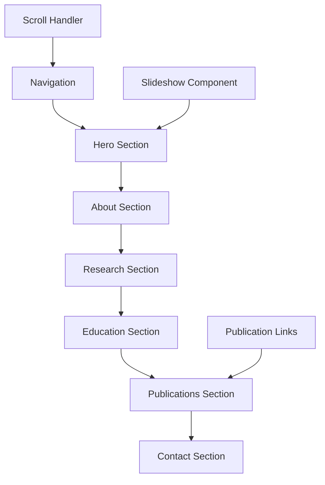
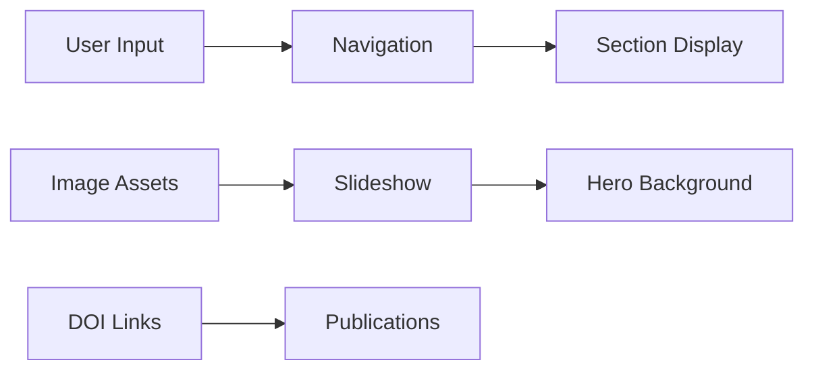

# System Architecture

## Component Diagram

```mermaid
graph TD
    A[Navigation] --> B[Hero Section]
    B --> C[About Section]
    C --> D[Research Section]
    D --> E[Education Section]
    E --> F[Publications Section]
    F --> G[Contact Section]
    
    H[Slideshow Component] --> B
    I[Scroll Handler] --> A
    J[Publication Links] --> F
```

## Data Flow

```mermaid
graph LR
    A[User Input] --> B[Navigation]
    B --> C[Section Display]
    D[Image Assets] --> E[Slideshow]
    E --> F[Hero Background]
    G[DOI Links] --> H[Publications]
```